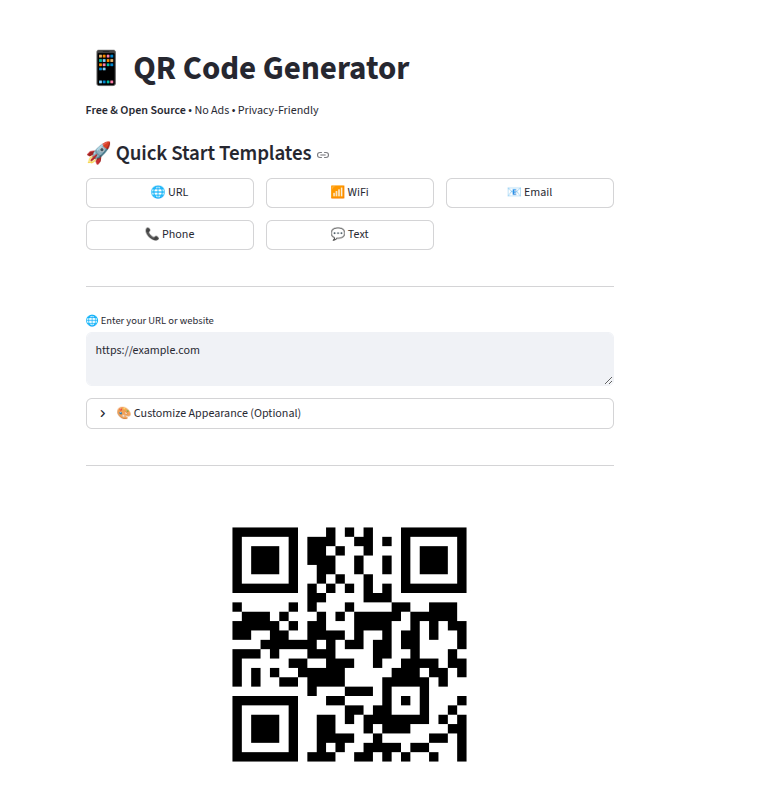

# 📱 QR Code Generator

**Free & Open Source** • **No Ads** • **Privacy-Friendly**

A beautiful, easy-to-use QR code generator built with Streamlit. Create custom QR codes with various styles, colors, and logos - all in your browser, completely free!



---

## ✨ Features

### 🚀 **Quick Start Templates**
- **URL** - Website links and landing pages
- **WiFi** - Share WiFi credentials instantly
- **Email** - mailto links with pre-filled subject/body
- **Phone** - Click-to-call phone numbers
- **Text** - Any plain text message

### 🎨 **Customization Options**
- **Colors** - Custom foreground and background colors
- **Shapes** - Square, Rounded, Circle, Gapped Square modules
- **Resolution** - Adjustable size (5-30 pixels per module)
- **Error Correction** - 4 levels (Low, Medium, High, Very High)
- **Logo Integration** - Add your logo to the center of QR codes

### 🛡️ **Privacy First**
- ✅ No data collection
- ✅ No tracking or analytics
- ✅ Everything runs in your browser
- ✅ No registration required
- ✅ Open source code

---

## 🚀 Live Demo

**Try it now:** [streamlit-qrcode.streamlit.app](https://streamlit-qrcode.streamlit.app) *(update with your actual URL)*

---

## 💻 Run Locally

### Prerequisites
- Python 3.7 or higher
- pip package manager

### Installation

```bash
# Clone the repository
git clone https://github.com/kaiser-data/streamlit-qrcode.git
cd streamlit-qrcode

# Install dependencies
pip install -r requirements.txt

# Run the app
streamlit run qr_generator.py
```

The app will open in your browser at `http://localhost:8501`

---

## 🎯 Use Cases

| Use Case | Example | Description |
|----------|---------|-------------|
| **Marketing** | Product pages, promotions | Link to campaigns and track engagement |
| **Events** | Tickets, schedules | Easy access to event information |
| **WiFi Sharing** | Guest network access | Share WiFi without typing passwords |
| **Business Cards** | vCard, LinkedIn | Digital contact information |
| **Restaurants** | Menus, ordering | Contactless menu access |
| **Education** | Resources, assignments | Quick access to learning materials |

---

## 📖 How to Use

### Basic Usage
1. **Choose a template** or enter content directly
2. **(Optional)** Customize colors, shapes, and size
3. **Download** your QR code as PNG

### WiFi QR Codes
1. Click the **WiFi** template
2. Enter your network name and password
3. Select security type (WPA/WEP/None)
4. Download and share!

### Adding Logos
1. Expand **"Customize Appearance"**
2. Go to **Logo** tab
3. Upload your logo (PNG recommended)
4. Adjust logo size (keep under 30% for best scanning)
5. Use **High** or **Very High** error correction

---

## 🛠️ Technical Details

### Built With
- **[Streamlit](https://streamlit.io)** - Web framework
- **[python-qrcode](https://github.com/lincolnloop/python-qrcode)** - QR code generation
- **[Pillow](https://python-pillow.org/)** - Image processing

### Features
- **Error Correction Levels**: L (7%), M (15%), Q (25%), H (30%)
- **Module Shapes**: Square, Rounded, Circle, Gapped Square
- **Output Format**: PNG with adjustable resolution
- **Logo Support**: Centered logo with automatic sizing

### Supported QR Code Types
- URLs and websites
- WiFi credentials (WPA/WEP/Open)
- Email addresses (mailto links)
- Phone numbers (tel links)
- SMS messages
- Plain text
- Any custom formatted string

---

## 📦 Deployment

### Hugging Face Spaces (Recommended - Free)

**✅ Better Privacy** - Only requires Space-level access, not full GitHub account access.

**📖 Complete Guide:** See [DEPLOY_HUGGINGFACE.md](DEPLOY_HUGGINGFACE.md) for detailed step-by-step instructions.

**Quick Start:**
1. Create account at [huggingface.co/join](https://huggingface.co/join)
2. Create new Space with **Docker SDK**
3. Upload: `qr_generator.py`, `requirements.txt`, `Dockerfile`, `README_HF.md` (as README.md)
4. Wait 2-5 minutes for build
5. Your app is live! 🎉

### Streamlit Cloud (Alternative)

⚠️ **Note:** Requires extensive GitHub permissions (full repository access).

1. **Fork this repository** or push to your GitHub account
2. **Deploy to Streamlit Cloud:**
   - Go to [share.streamlit.io](https://share.streamlit.io)
   - Click "New app"
   - Select your repository: `kaiser-data/streamlit-qrcode`
   - Main file: `qr_generator.py`
   - Click "Deploy"
3. **Your app will be live** at a free Streamlit URL in ~2 minutes!

### Other Platforms
- **Heroku**: Add `setup.sh` and `Procfile`
- **Docker**: Build from included `Dockerfile`
- **VPS**: Run with `streamlit run qr_generator.py --server.port 80`

---

## 💡 Best Practices

### For Optimal Scanning
- ✅ Keep content short (use URL shorteners for long links)
- ✅ Use high contrast (dark on light background)
- ✅ Minimum print size: 2×2 cm (0.8×0.8 inches)
- ✅ Test QR codes before mass printing
- ✅ Use higher error correction when adding logos

### For Logo Integration
- ✅ Use transparent PNG images
- ✅ Keep logo size under 30% of QR code
- ✅ Use "High" or "Very High" error correction
- ✅ Test scannability after adding logo
- ✅ Ensure logo doesn't obscure critical areas

---

## 🤝 Contributing

Contributions are welcome! Here's how you can help:

1. **Fork the repository**
2. **Create a feature branch** (`git checkout -b feature/AmazingFeature`)
3. **Commit your changes** (`git commit -m 'Add some AmazingFeature'`)
4. **Push to the branch** (`git push origin feature/AmazingFeature`)
5. **Open a Pull Request**

### Ideas for Contributions
- [ ] Additional QR code styles
- [ ] Batch QR code generation
- [ ] SVG export option
- [ ] QR code analytics
- [ ] More customization options
- [ ] Internationalization (i18n)

---

## 📄 License

This project is licensed under the **MIT License** - see the [LICENSE](LICENSE) file for details.

### What this means:
- ✅ Free to use for personal and commercial projects
- ✅ Modify and distribute as you like
- ✅ No warranty or liability
- ✅ Must include original license and copyright

---

## 🙏 Acknowledgments

- **QR Code Technology**: Invented by Denso Wave (1994)
- **Streamlit Team**: For the amazing framework
- **python-qrcode**: For the robust QR generation library
- **Community**: For feedback and contributions

---

## 📞 Support

- **Issues**: [GitHub Issues](https://github.com/kaiser-data/streamlit-qrcode/issues)
- **Discussions**: [GitHub Discussions](https://github.com/kaiser-data/streamlit-qrcode/discussions)
- **Star this repo** if you find it useful! ⭐

---

## 🔒 Privacy & Security

This app is designed with privacy in mind:

- **No data storage**: QR codes are generated in your browser and not stored
- **No tracking**: No analytics or tracking cookies
- **No server-side processing**: All processing happens client-side
- **Open source**: Full code transparency - see exactly what it does
- **No third-party services**: No external API calls or data sharing

---

## 📊 Project Stats


---

<div align="center">

**Made with Python & Streamlit**

[Report Bug](https://github.com/kaiser-data/streamlit-qrcode/issues) • [Request Feature](https://github.com/kaiser-data/streamlit-qrcode/issues) • [View Demo](https://streamlit-qrcode.streamlit.app)

</div>
